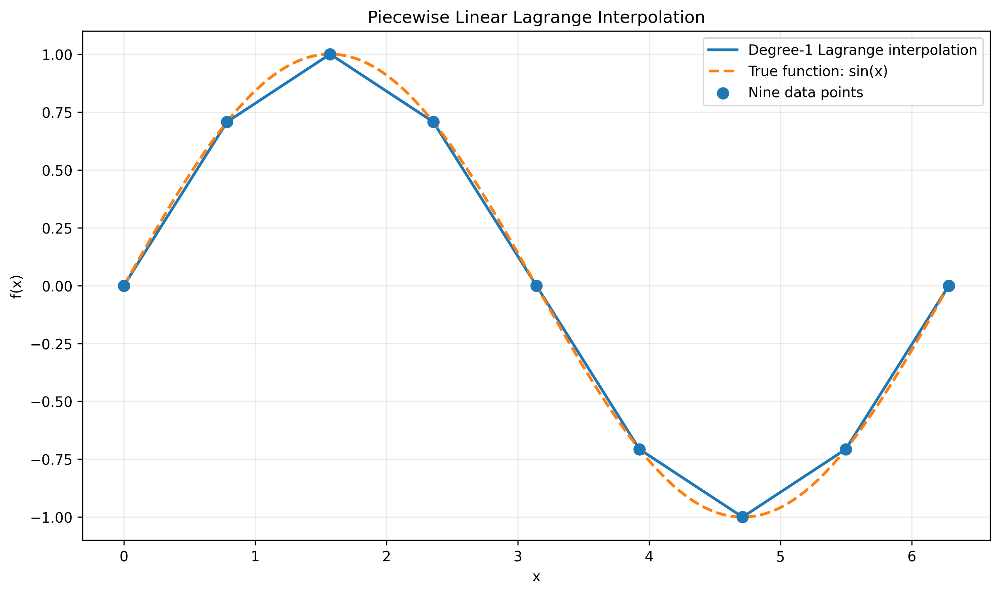
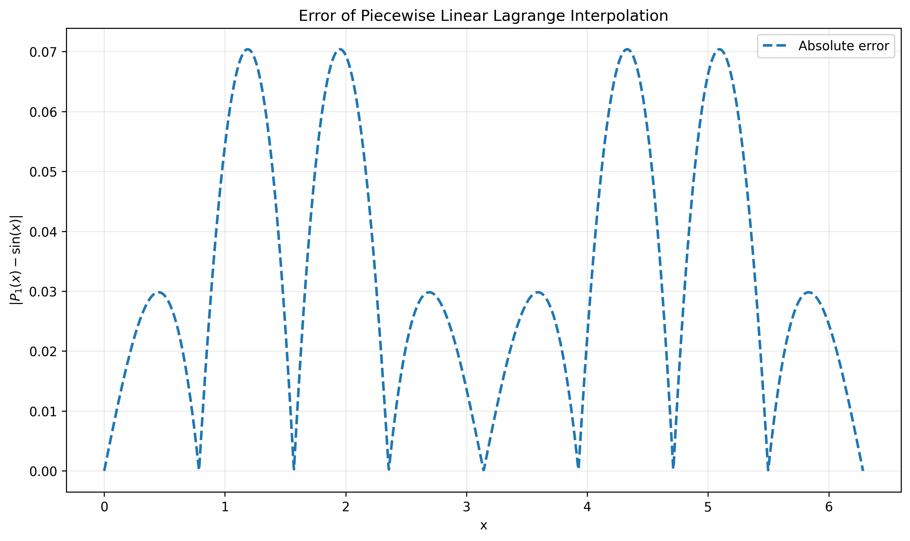
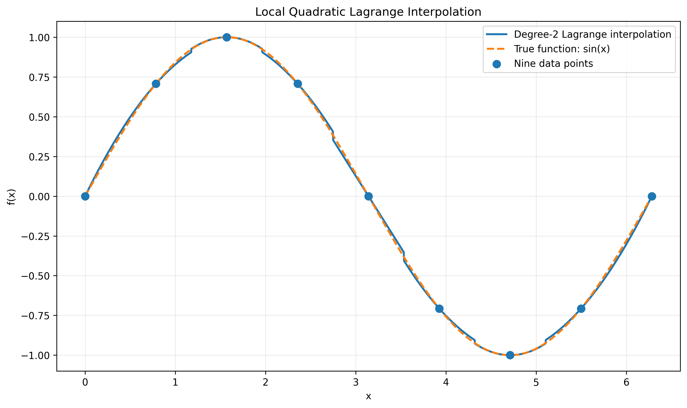
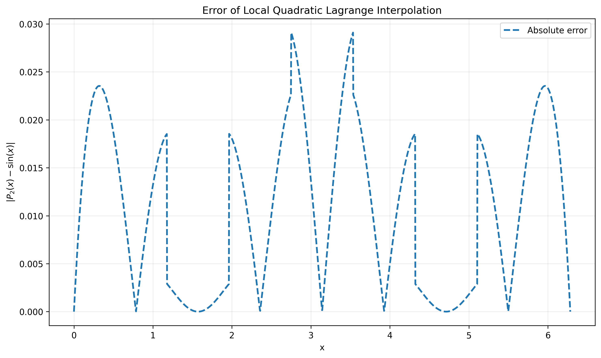

# Computational-Physics
An undergraduate course I taught at Hebei Normal University (see:https://llyq17.github.io/Computational-Physics/README.html)

## 1. Introduction and why interpolation
Interpolation is a numerical technique used to estimate values of a function at points that are not directly given by the data. In scientific computing and experimental physics, measurements are often available only at discrete sample points, while the underlying behavior is continuous. Interpolation provides a practical way to reconstruct a smooth curve between known values, which is useful for data analysis, visualization, and numerical simulation.

Interpolation is especially important because many physical quantities are observed only at selected positions or times. Instead of treating the data as a set of isolated points, we can use interpolation to obtain a reasonable approximation of the function between those points. Compared with direct measurement, interpolation is often more efficient and helps us understand the trend of the data.

## 1.1 Lagrange interpolation
Lagrange interpolation constructs a polynomial that passes through all given data points. For points $(x_0,y_0), (x_1,y_1), \dots, (x_n,y_n)$, the interpolation polynomial is written as a sum of basis polynomials:

$$
P(x)=\sum_{i=0}^{n} y_i \prod_{j\ne i}\frac{x-x_j}{x_i-x_j}
$$

This method is straightforward and is often used when the number of sample points is small. Its advantage is that the polynomial is guaranteed to pass through every given point. However, for large numbers of data points, the resulting polynomial may become unstable and oscillatory.


### Code example: linear Lagrange interpolation for $\sin(x)$
Here is a simple Python example using linear Lagrange interpolation on the function $\sin(x)$.

```python
import os

import numpy as np
import matplotlib.pyplot as plt
from scipy.interpolate import lagrange


# 如果 Figures 文件夹不存在，则自动创建
os.makedirs("Figures", exist_ok=True)


def linear_interpolation(x_nodes, y_nodes, x):
    """
    一次拉格朗日插值，即分段线性插值。

    对每个计算点，选取其所在区间的两个相邻节点，
    再调用 scipy.interpolate.lagrange 构造一次多项式。
    """

    y_linear = np.empty_like(x, dtype=float)
    n_nodes = len(x_nodes)

    for k, x_value in enumerate(x):
        if x_value <= x_nodes[0]:
            start = 0
        elif x_value >= x_nodes[-1]:
            start = n_nodes - 2
        else:
            right = np.searchsorted(x_nodes, x_value, side="right")
            start = right - 1

        polynomial = lagrange(
            x_nodes[start:start + 2],
            y_nodes[start:start + 2]
        )
        y_linear[k] = polynomial(x_value)

    return y_linear

# 在区间 [0, 2π] 上构造 9 个等距插值节点
x_nodes = np.linspace(0.0, 2.0 * np.pi, 9)
y_nodes = np.sin(x_nodes)

# 构造致密网格，用于绘图和误差计算
x = np.linspace(0.0, 2.0 * np.pi, 2000)
y_true = np.sin(x)

# 一次拉格朗日插值
y_linear = linear_interpolation(x_nodes, y_nodes, x)
error_linear = np.abs(y_linear - y_true)

# 一次拉格朗日插值曲线
plt.figure(figsize=(10, 6))
plt.scatter(x_nodes, y_nodes, s=60, label="Nine data points", zorder=3)
plt.plot(x, y_linear, linewidth=2, label="Degree-1 Lagrange interpolation")
plt.plot(x, y_true, "--", linewidth=2, label="True function: sin(x)")
plt.xlabel("x")
plt.ylabel("f(x)")
plt.title("Piecewise Linear Lagrange Interpolation")
plt.grid(alpha=0.25)
plt.legend()
plt.tight_layout()
plt.savefig("Figures/linear_lagrange.png", dpi=300, bbox_inches="tight")
plt.show()

# 一次拉格朗日插值误差
plt.figure(figsize=(10, 6))
plt.plot(x, error_linear, "--", linewidth=2, label="Absolute error")
plt.xlabel("x")
plt.ylabel(r"$|P_1(x)-\sin(x)|$")
plt.title("Error of Piecewise Linear Lagrange Interpolation")
plt.grid(alpha=0.25)
plt.legend()
plt.tight_layout()
plt.savefig("Figures/linear_lagrange_error.png", dpi=300, bbox_inches="tight")
plt.show()
```
The resulting plot is shown below:



The corresponding figure is stored in [Figures/linear_lagrange.png](Figures/linear_lagrange.png). and [Figures/linear_lagrange_error.png](Figures/linear_lagrange_error.png)


### Code example: quadratic Lagrange interpolation for $\sin(x)$
Here is a simple Python example using quadratic Lagrange interpolation on the function $\sin(x)$.

```python
import os

import numpy as np
import matplotlib.pyplot as plt
from scipy.interpolate import lagrange


# 如果 Figures 文件夹不存在，则自动创建
os.makedirs("Figures", exist_ok=True)


def quadratic_interpolation(x_nodes, y_nodes, x):
    """
    二次拉格朗日插值，即局部抛物线插值。

    对每个计算点，选取附近的三个连续节点，
    再调用 scipy.interpolate.lagrange 构造二次多项式。
    """

    y_quadratic = np.empty_like(x, dtype=float)
    n_nodes = len(x_nodes)

    for k, x_value in enumerate(x):
        nearest = int(np.argmin(np.abs(x_nodes - x_value)))
        start = nearest - 1
        start = max(start, 0)
        start = min(start, n_nodes - 3)

        polynomial = lagrange(
            x_nodes[start:start + 3],
            y_nodes[start:start + 3]
        )
        y_quadratic[k] = polynomial(x_value)

    return y_quadratic

# 在区间 [0, 2π] 上构造 9 个等距插值节点
x_nodes = np.linspace(0.0, 2.0 * np.pi, 9)
y_nodes = np.sin(x_nodes)

# 构造致密网格，用于绘图和误差计算
x = np.linspace(0.0, 2.0 * np.pi, 2000)
y_true = np.sin(x)

# 二次拉格朗日插值
y_quadratic = quadratic_interpolation(x_nodes, y_nodes, x)
error_quadratic = np.abs(y_quadratic - y_true)

# 二次拉格朗日插值曲线
plt.figure(figsize=(10, 6))
plt.scatter(x_nodes, y_nodes, s=60, label="Nine data points", zorder=3)
plt.plot(x, y_quadratic, linewidth=2, label="Degree-2 Lagrange interpolation")
plt.plot(x, y_true, "--", linewidth=2, label="True function: sin(x)")
plt.xlabel("x")
plt.ylabel("f(x)")
plt.title("Local Quadratic Lagrange Interpolation")
plt.grid(alpha=0.25)
plt.legend()
plt.tight_layout()
plt.savefig("Figures/quadratic_lagrange.png", dpi=300, bbox_inches="tight")
plt.show()

# 二次拉格朗日插值误差
plt.figure(figsize=(10, 6))
plt.plot(x, error_quadratic, "--", linewidth=2, label="Absolute error")
plt.xlabel("x")
plt.ylabel(r"$|P_2(x)-\sin(x)|$")
plt.title("Error of Local Quadratic Lagrange Interpolation")
plt.grid(alpha=0.25)
plt.legend()
plt.tight_layout()
plt.savefig("Figures/quadratic_lagrange_error.png", dpi=300, bbox_inches="tight")
plt.show()
```
The resulting plot is shown below:



The corresponding figure is stored in [Figures/linear_lagrange.png](Figures/quadratic_lagrange.png). and [Figures/linear_lagrange_error.png](Figures/quadratic_lagrange_error.png)


## 1.2 Newton interpolation
Newton interpolation is another polynomial interpolation method. It expresses the interpolation polynomial in a form based on finite differences, making it convenient for adding new data points incrementally. In general, the Newton form can be written as:

$$
P(x)=a_0+a_1(x-x_0)+a_2(x-x_0)(x-x_1)+\cdots+a_n(x-x_0)(x-x_1)\cdots(x-x_{n-1}),
$$

where the coefficients $a_k$ are determined by divided differences:

$$
a_0 = f(x_0),
$$

$$
a_1 = \frac{f(x_1)-f(x_0)}{x_1-x_0},
$$

$$
a_2 = \frac{\frac{f(x_2)-f(x_1)}{x_2-x_1}-\frac{f(x_1)-f(x_0)}{x_1-x_0}}{x_2-x_0},
$$

and similarly for higher orders. This formulation is especially useful because when a new data point is added, only the new divided differences are needed, so the interpolation polynomial can be updated efficiently.

## 1.3 Cubic spline interpolation
Cubic spline interpolation is a piecewise polynomial method in which the interval between neighboring data points is represented by a cubic polynomial. On each subinterval $[x_i,x_{i+1}]$, one writes

$$
S_i(x)=a_i+b_i(x-x_i)+c_i(x-x_i)^2+d_i(x-x_i)^3,
$$

where $a_i,b_i,c_i,d_i$ are coefficients determined by the interpolation conditions. The spline is constructed so that the function values, first derivatives, and second derivatives are continuous at the knots:

$$
S_i(x_i)=f(x_i), \qquad S_{i+1}(x_{i+1})=f(x_{i+1}),
$$

$$
S_i'(x_{i+1})=S_{i+1}'(x_{i+1}), \qquad S_i''(x_{i+1})=S_{i+1}''(x_{i+1}).
$$

This produces a smooth curve and avoids the large oscillations that may appear in high-degree polynomial interpolation. Because of its smoothness and stability, cubic spline interpolation is widely used in engineering, computer graphics, and scientific data fitting. It is often preferred when a visually smooth and physically reasonable curve is needed.


## 1.4 Runge's phenomenon

A classic warning about high-degree polynomial interpolation is Runge's phenomenon. If we interpolate the function

$$
f(x)=\frac{1}{1+x^2},\qquad x\in[-5,5],
$$

using many equally spaced nodes, the interpolating polynomial may oscillate strongly near the endpoints. This shows that increasing the degree of the polynomial does not always improve the approximation.

The notebook [Code/runge_interpolation_comparison.ipynb](Code/runge_interpolation_comparison.ipynb) compares several approaches:

The resulting comparison figure is stored in [Figures/Runge_comparison.png](Figures/Runge_comparison.png).

This example illustrates why piecewise and spline-based methods are often more stable than one single high-degree polynomial.
